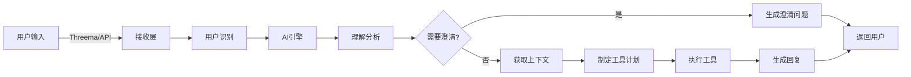
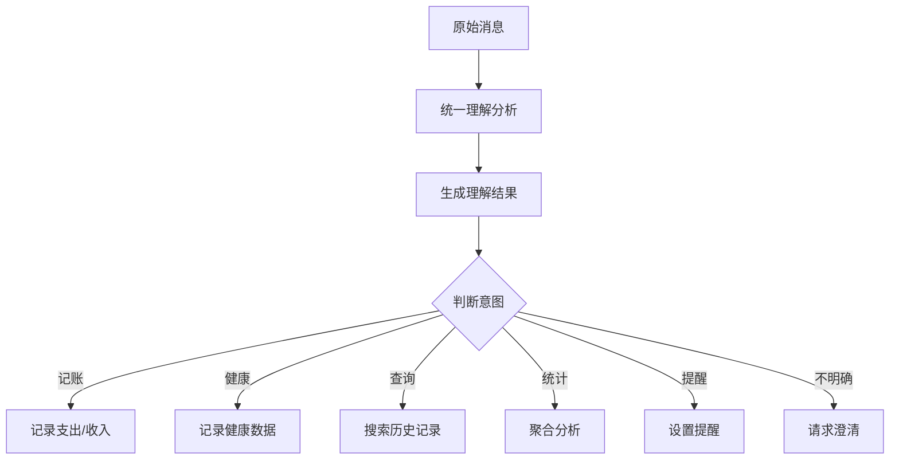
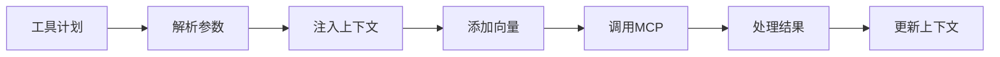
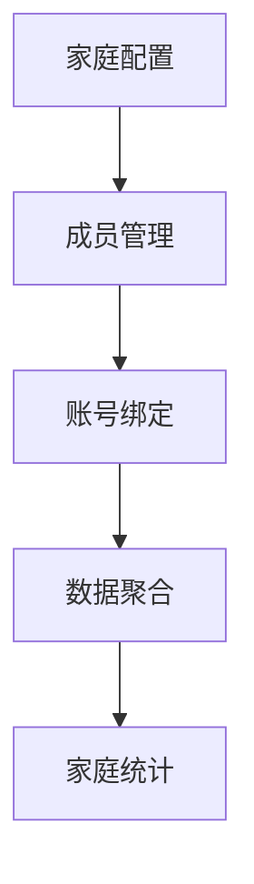
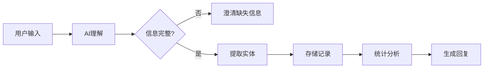
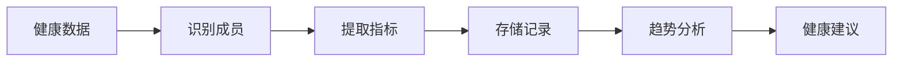
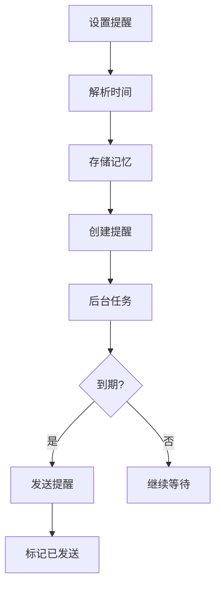

# FAA 业务流程文档

## 一、系统概览

FAA（Family AI Assistant）是一个完全由 AI 驱动的家庭助手系统，通过自然语言交互帮助家庭记录、查询和管理日常信息。

## 二、核心业务流程

### 2.1 消息接收与处理流程



#### 2.1.1 Threema 消息处理

1. **Webhook 接收**
   - 端点：`/webhook/threema`
   - 验证消息 MAC
   - 解密消息内容

2. **用户识别**
   - 根据 Threema ID 查找用户
   - 新用户自动创建账号
   - 建立 channel 绑定关系

3. **附件处理**
   - 保存到 `MEDIA_ROOT/YYYY/MM/`
   - 异步派生文本（语音转写/OCR/图像理解）
   - 存储派生结果供 AI 使用

4. **AI 处理**
   - 调用 AI Engine 处理消息
   - 使用发送者 ID 作为 thread_id
   - 包含所有上下文信息

5. **回复发送**
   - 通过 Threema Gateway 发送
   - 长度限制 500 字符
   - 失败不重试（避免重复）

#### 2.1.2 API 直接调用

1. **端点**：`POST /message`
2. **参数**：
   - content: 消息内容
   - user_id: 用户标识
   - thread_id: 会话线程（可选）

3. **处理流程**：
   - 直接调用 AI Engine
   - channel 标记为 "api"
   - 返回 JSON 响应

### 2.2 AI 理解与决策流程



#### 2.2.1 理解分析契约

AI 理解分析输出固定的 JSON 结构：

```json
{
  "understanding": {
    "intent": "识别的意图",
    "entities": {
      // AI 提取的所有实体
    },
    "need_action": true/false,
    "need_clarification": true/false,
    "missing_fields": [],
    "clarification_questions": [],
    "context_link": {
      "scope": "family/person/self",
      "person_ids": []
    },
    "occurred_at": "ISO时间"
  },
  "context_requests": [
    // AI 需要的上下文数据
  ],
  "tool_plan": {
    "steps": [
      // 计划执行的工具
    ]
  },
  "response_directives": {
    "profile": "default/compact/detailed"
  }
}
```

#### 2.2.2 上下文请求类型

- **recent_memories**: 最近的对话记录
- **semantic_search**: 语义相关搜索
- **direct_search**: 精确条件搜索
- **thread_summaries**: 会话摘要

### 2.3 工具执行流程



#### 2.3.1 核心工具能力

1. **store（存储）**
   - 存储任意信息到记忆库
   - AI 决定存储内容和结构
   - 自动生成语义向量

2. **search（搜索）**
   - 语义搜索（使用向量）
   - 精确过滤（使用条件）
   - 支持共享线程模式

3. **aggregate（聚合）**
   - 统计操作：sum/count/avg/min/max
   - 分组聚合：按天/周/月
   - 家庭范围聚合

4. **schedule_reminder（提醒）**
   - 设置定时提醒
   - 支持重复提醒
   - 后台任务执行

### 2.4 家庭数据管理流程



#### 2.4.1 家庭结构

```
家庭（Household）
  ├── 成员1（Member）
  │   ├── 账号1（User Account）
  │   └── 账号2（User Account）
  ├── 成员2（Member）
  │   └── 账号3（User Account）
  └── 成员3（Member）[无账号]
```

#### 2.4.2 数据范围

1. **个人范围**：单个 user_id 的数据
2. **成员范围**：某个成员所有账号的数据
3. **家庭范围**：所有成员的聚合数据

### 2.5 记账业务流程



#### 2.5.1 典型对话

```
用户：今天买菜花了50块
AI理解：
- intent: 记录支出
- entities: {amount: 50, category: "买菜", occurred_at: "2025-01-28"}
- need_action: true

执行：
1. store(content="今天买菜花了50块", ai_data={...})
2. 生成回复："已记录，本月买菜支出累计 ¥350"
```

#### 2.5.2 多轮澄清

```
用户：记一下买衣服
AI：请问花了多少钱？给谁买的？

用户：300，给女儿
AI理解：合并信息 -> 完整记录
```

### 2.6 健康记录流程



#### 2.6.1 支持的健康数据

- 身高、体重
- 血压、血糖
- 体温
- 用药记录
- 体检结果（图片 OCR）

#### 2.6.2 数据处理

1. **成员识别**：确定是哪个家庭成员
2. **时间标记**：记录测量时间
3. **趋势分析**：对比历史数据
4. **异常提醒**：超出正常范围时提醒

### 2.7 提醒管理流程



#### 2.7.1 提醒类型

- **一次性提醒**：指定时间触发一次
- **每日提醒**：每天固定时间
- **自定义周期**：按需设置

#### 2.7.2 执行机制

- 后台任务每分钟检查
- 获取所有待发送提醒
- 通过 Threema 发送
- 标记为已发送

### 2.8 查询与统计流程


#### 2.8.1 查询类型

1. **语义查询**："最近的餐饮支出"
2. **精确查询**："1月份电费"
3. **统计查询**："本月支出总额"
4. **对比查询**："这个月比上个月多花了多少"

#### 2.8.2 结果展示

- 文字描述
- 数据列表
- 统计摘要
- 图表（通过 render_chart）

## 三、数据流转

### 3.1 数据存储流

```
用户输入 → AI理解 → 实体提取 → 向量生成 → 数据库存储
                          ↓
                    ai_understanding (JSONB)
                          ↓
                    {任意AI决定的字段}
```

### 3.2 数据查询流

```
查询需求 → 语义向量 → 相似度检索 → 过滤筛选 → 结果排序 → AI整理 → 用户展示
              ↓
         精确条件 → SQL过滤
```

### 3.3 数据聚合流

```
统计需求 → 确定范围 → 构建查询 → 执行聚合 → 结果处理 → 生成报告
              ↓
         家庭/成员/个人
```

## 四、错误处理机制

### 4.1 容错策略

1. **AI 理解失败**：返回通用回复，请求重试
2. **工具调用失败**：降级处理，返回部分结果
3. **数据库错误**：缓存降级，延迟写入
4. **外部服务失败**：本地处理，异步重试

### 4.2 用户友好

- 错误信息人性化
- 提供解决建议
- 保持对话连续性
- 不暴露技术细节

## 五、性能优化

### 5.1 缓存机制

- **Prompt 缓存**：避免重复加载
- **工具规格缓存**：减少 MCP 调用
- **向量缓存**：trace级 + 全局LRU
- **家庭上下文缓存**：60秒 TTL

### 5.2 批处理

- 批量存储（batch_store）
- 批量搜索（batch_search）
- 批量向量生成

### 5.3 异步处理

- 附件派生异步
- 提醒检查异步
- 线程摘要异步

## 六、安全与隐私

### 6.1 数据隔离

- user_id 严格隔离
- 共享线程需显式开启
- 查询结果数量限制

### 6.2 敏感信息

- 不主动展示密码等敏感信息
- 需要时提示风险
- 支持软删除

### 6.3 访问控制

- Threema 端到端加密
- 签名媒体链接
- API 认证（待实现）

## 七、扩展性设计

### 7.1 新功能添加

只需要：
1. 更新 Prompt 描述新功能
2. （可选）添加新的 MCP 工具
3. 无需修改核心代码

### 7.2 新渠道接入

1. 实现新的 webhook 路由
2. 用户识别与绑定
3. 复用 AI Engine

### 7.3 能力提升

- 升级 AI 模型
- 优化 Prompt
- 数据积累学习

## 八、运维支持

### 8.1 健康检查

- `/health` 端点
- 数据库连接检查
- MCP 服务可用性

### 8.2 日志追踪

- 结构化日志（structlog）
- trace_id 全程追踪
- 工具调用记录

### 8.3 监控指标（建议）

- 消息处理量
- 响应时间
- 工具调用成功率
- AI 理解准确率

## 九、典型使用场景

### 场景1：家庭记账

```
妈妈：今天超市买东西花了238
爸爸：我刚才加油花了300
孩子：我买文具花了25

月底：这个月我们家一共花了多少钱？
AI：本月家庭总支出 ¥8,563，其中生活用品 ¥3,200...
```

### 场景2：健康管理

```
用户：记录一下，儿子今天体重32公斤，身高125cm
AI：已记录。相比上个月，身高增长2cm，体重增加1kg，发育正常。

用户：儿子最近的身高体重变化
AI：[生成成长曲线图]
```

### 场景3：日程提醒

```
用户：提醒我明天下午3点开会
AI：好的，明天下午3点会提醒您开会

次日15:00
AI：⏰ 提醒：您有一个会议安排
```

## 十、总结

FAA 的业务流程设计充分体现了 AI 驱动的理念：

1. **统一入口**：所有业务都通过同一个消息处理流程
2. **AI 主导**：由 AI 决定如何理解、如何处理、如何回复
3. **工具支撑**：通用工具提供能力，AI 决定如何组合使用
4. **数据开放**：不限制数据结构，AI 自由发挥
5. **持续进化**：随 AI 能力提升自动获得新功能

这种设计使得系统极其灵活，可以适应各种家庭场景的需求，同时保持工程实现的简洁性。
