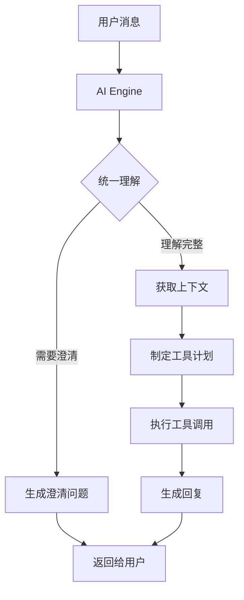

# FAA 项目深度分析报告

## 一、项目总体评价

### 1.1 设计理念执行情况 ✅

FAA 项目很好地实现了 "AI 驱动、工程固定、能力自动增长" 的核心设计理念：

**优秀实践：**
- ✅ **AI 完全主导决策**：通过统一的契约结构（understanding, context_requests, tool_plan, response_directives），让 AI 决定所有业务逻辑
- ✅ **数据结构开放性**：JSONB 字段 `ai_understanding` 允许 AI 自由决定存储内容，不限制未来发展
- ✅ **工具完全通用化**：MCP 工具不含任何业务逻辑，仅提供基础能力（store/search/aggregate）
- ✅ **Prompt 驱动演进**：通过 YAML 配置即可改变系统行为，无需修改代码
- ✅ **智能上下文管理**：AI 自主决定需要什么上下文（recent_memories/semantic_search等）

### 1.2 工程简化情况 ✅

项目成功实现了工程简化的目标：

**简化成果：**
- ✅ **统一处理流程**：单一的 `process_message` 入口处理所有消息类型
- ✅ **最小化硬编码**：几乎没有业务逻辑硬编码在工程层
- ✅ **清晰的层次结构**：API → AI Engine → MCP Tools → Database
- ✅ **模块化设计**：各组件职责明确，耦合度低

## 二、核心模块分析

### 2.1 AI Engine（src/ai_engine.py）

**设计亮点：**
1. **统一理解流程**：删除了原有的复杂多步理解（light_understand → merge_followup → re_understand），改为单一 AI 理解
2. **智能工具调用**：通过元数据动态判断工具能力，避免硬编码工具特性
3. **性能优化**：
   - 嵌入向量缓存（trace级 + 全局LRU）
   - 工具时间预算管理
   - 智能判断是否需要语义搜索

**存在问题：**
- ❌ 代码中有重复定义（`_is_simple_actions_only` 和 `_execute_tool_steps` 重复定义了两次）
- ❌ 部分方法过长，如 `process_message` 有 150+ 行
- ❌ 缺少充分的中文注释

### 2.2 Prompt Manager（src/core/prompt_manager.py）

**设计亮点：**
1. **块化装配**：通过 blocks 复用 prompt 片段
2. **版本管理**：支持多版本并存，可随时切换
3. **Profile 覆写**：不同渠道（如 Threema）可以有不同的回复风格
4. **动态工具注入**：自动从 MCP 获取工具列表并注入到 prompt

### 2.3 MCP Server（mcp-server/generic_mcp_server.py）

**设计亮点：**
1. **完全通用化**：没有任何业务逻辑，纯粹的数据操作工具
2. **向量支持**：统一由 AI Engine 生成向量，MCP 只负责存储和检索
3. **智能索引**：自动创建计算列和索引优化查询性能
4. **HTTP 包装**：支持容器化部署

### 2.4 家庭服务（src/services/household_service.py）

**设计亮点：**
1. **智能聚合**：自动聚合家庭成员的 user_id 用于家庭级统计
2. **缓存机制**：60秒 TTL 缓存避免频繁数据库查询
3. **自动初始化**：自动创建默认家庭确保系统可用

## 三、改进建议

### 3.1 代码质量改进 🔧

```python
# 1. 删除重复代码
# ai_engine.py 中删除第二个 _is_simple_actions_only 定义（1392-1434行）
# 删除第二个 _execute_tool_steps 定义（1436-1535行）

# 2. 拆分长方法
# 将 process_message 拆分为更小的方法：
async def process_message(...):
    # 步骤1：预处理
    content = await self._preprocess_message(content, context)
    
    # 步骤2：理解消息
    analysis = await self._analyze_with_context(content, user_id, context)
    
    # 步骤3：处理澄清
    if analysis.understanding.need_clarification:
        return await self._handle_clarification(analysis, context)
    
    # 步骤4：执行并回复
    return await self._execute_and_respond(analysis, user_id, context)

# 3. 统一错误处理
class AIEngineError(Exception):
    """AI 引擎基础异常"""
    pass

class MCPToolError(AIEngineError):
    """MCP 工具调用异常"""
    pass
```

### 3.2 进一步减少硬编码 🎯

```python
# 1. 动态工具白名单
# 当前在 _execute_tool_steps 中硬编码了工具列表，可以改为：
async def _get_allowed_tools(self) -> Set[str]:
    """从 MCP 动态获取允许的工具列表"""
    specs = await self._get_tool_specs()
    return {tool['name'] for tool in specs.get('tools', [])}

# 2. 移除硬编码的工具特性判断
# 完全依赖 MCP 元数据，而不是在引擎中判断
```

### 3.3 增强可观测性 📊

```python
# 1. 添加性能指标收集
from prometheus_client import Counter, Histogram

message_counter = Counter('faa_messages_total', 'Total messages processed')
message_duration = Histogram('faa_message_duration_seconds', 'Message processing duration')

# 2. 添加追踪
from opentelemetry import trace
tracer = trace.get_tracer(__name__)

@tracer.start_as_current_span("process_message")
async def process_message(...):
    ...
```

### 3.4 优化 Prompt 管理 📝

```yaml
# 建议在 prompts/family_assistant_prompts.yaml 中添加：
blocks:
  # 添加更多场景化的块
  expense_understanding: |
    对于财务记录，请特别注意：
    - 金额的准确性
    - 消费类别的自动识别
    - 与历史消费模式的对比
  
  health_understanding: |
    对于健康记录，请关注：
    - 数值的变化趋势
    - 异常值的提醒
    - 家庭成员的区分
```

### 3.5 数据库优化 🗄️

```sql
-- 建议添加的索引
CREATE INDEX idx_memories_user_thread_time ON memories(user_id, thread_id_extracted, occurred_at DESC);
CREATE INDEX idx_memories_family_scope ON memories(ai_understanding->>'family_scope') WHERE ai_understanding ? 'family_scope';

-- 建议添加的物化视图（用于加速统计）
CREATE MATERIALIZED VIEW mv_monthly_expenses AS
SELECT 
    user_id,
    date_trunc('month', occurred_at) as month,
    category_extracted as category,
    SUM(amount) as total_amount,
    COUNT(*) as count
FROM memories
WHERE type_extracted = 'expense' AND amount IS NOT NULL
GROUP BY user_id, month, category;
```

## 四、核心业务流程

### 4.1 消息处理流程



### 4.2 AI 理解契约

```json
{
  "understanding": {
    "intent": "记录支出",
    "entities": {
      "amount": 50,
      "category": "食品",
      "occurred_at": "2025-01-28T10:00:00"
    },
    "need_action": true,
    "need_clarification": false
  },
  "context_requests": [
    {
      "name": "recent_expenses",
      "kind": "semantic_search",
      "query": "最近的食品支出"
    }
  ],
  "tool_plan": {
    "steps": [
      {"tool": "store", "args": {...}}
    ]
  },
  "response_directives": {
    "profile": "compact"
  }
}
```

### 4.3 家庭数据聚合流程

```python
# 家庭级统计的实现
async def family_expense_summary(household_service, ai_engine):
    # 1. 获取家庭上下文
    context = await household_service.get_context()
    family_user_ids = context['family_scope']['user_ids']
    
    # 2. 批量查询所有成员数据
    results = await ai_engine._call_mcp_tool(
        'aggregate',
        user_id=family_user_ids,  # 传入列表
        operation='sum',
        field='amount',
        filters={'type': 'expense', 'date_from': '2025-01-01'}
    )
    
    # 3. AI 生成家庭财务报告
    return await ai_engine.generate_family_report(results, context)
```

## 五、最佳实践总结

### ✅ 做得很好的地方：

1. **AI 驱动理念贯彻彻底**：真正实现了让 AI 决定一切
2. **工程简化到位**：代码量少，逻辑清晰
3. **扩展性优秀**：通过 Prompt 和工具即可扩展功能
4. **性能优化合理**：缓存、索引、批处理都有考虑
5. **家庭场景支持完善**：多用户、多成员、聚合统计都支持

### ⚠️ 需要改进的地方：

1. **代码重复**：需要清理重复定义
2. **注释不足**：缺少中文注释，不利于理解
3. **错误处理**：可以更统一和优雅
4. **监控缺失**：缺少性能监控和追踪
5. **测试覆盖**：需要更多单元测试和集成测试

### 🎯 下一步行动建议：

1. **立即修复**：删除重复代码，添加必要注释
2. **短期优化**：拆分长方法，统一错误处理
3. **中期增强**：添加监控、追踪、测试
4. **长期演进**：持续优化 Prompt，扩展 MCP 工具集

## 六、总结

FAA 项目成功实现了 "AI 驱动、工程固定、能力自动增长" 的设计目标。项目架构清晰，代码简洁，真正做到了让 AI 主导业务逻辑，工程层只提供基础设施。这种设计使得系统可以随着 AI 模型的进步和 Prompt 的优化而自动获得新能力，无需修改代码。

项目的核心价值在于：
- **面向未来**：AI 能力提升，系统自动变强
- **维护简单**：代码量少，逻辑清晰
- **扩展容易**：通过 Prompt 和工具即可添加新功能

建议继续保持这种设计理念，同时关注代码质量和可观测性的提升，让系统更加健壮和易于运维。
