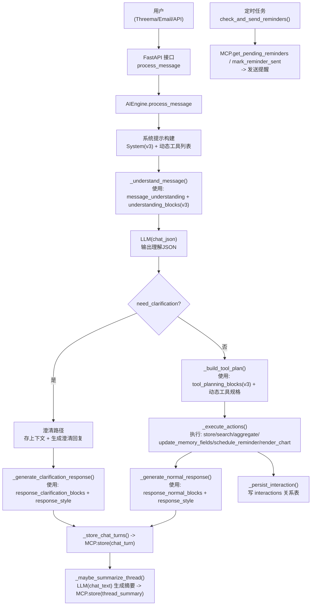

## FAA Prompt-Engine v3 使用说明

### 1. 总体目标
- 提示词分层：系统/理解/编排/回复，尽量避免重复；功能不变、token 更省。
- 行为规范与结构规范分离：理解阶段产出结构（understanding_spec），入库阶段推荐字段（ai_understanding_conventions）。

### 2. 流程图

### 3. 各阶段与提示词映射

- 系统提示构建（PromptManager.get_system_prompt_with_tools）
  - v3.system_blocks:
    - core_role, forbidden_topics, family_context, capabilities, available_tools(含 {{DYNAMIC_TOOLS}})
    - multimodal, privacy_policy, calendar_parsing_rules, length_constraints

- 理解阶段（AIEngine._understand_message）
  - 动态模板：blocks.message_understanding（插入 {history_context}/{context_info}）
  - 关键：`{understanding_guide}` = v3.understanding_blocks（由 PromptManager 拼装）
    - understanding_spec（精简版“必须输出字段+行为规范”）
    - time_parsing_rules, finance_extraction_rules, health_extraction_rules, reminder_extraction_rules
    - update_detection_rules, contextual_understanding_rules
    - ai_understanding_conventions（入库推荐字段：type/subtype/occurred_at/person/tags/external_id/source/version）

- 澄清/正常分流
  - need_clarification=true：先存“澄清上下文”，不执行业务动作，再走澄清回复
  - need_clarification=false：进入工具编排

- 工具编排（AIEngine._build_tool_plan）
  - v3.tool_planning_blocks:
    - tool_specification(含 {{DYNAMIC_TOOL_SPECS}}), tool_execution（仅输出 JSON steps）
    - 幂等/软 upsert：先 search(jsonb_equals) 再 store 或 update_memory_fields（携带 external_id/source/version）
    - chart_strategy, search_fallback

- 执行动作（AIEngine._execute_actions）
  - 允许工具：store, search, aggregate, schedule_reminder, get_pending_reminders, mark_reminder_sent, update_memory_fields, render_chart
  - 入库：store.ai_data 合并 entities，并尽量包含 occurred_at/thread_id/trace_id/attachments

- 回复生成（AIEngine._generate_*_response）
  - 澄清：v3.response_clarification_blocks = clarification_style + clarification_spec；并套用 response_style
  - 正常：v3.response_normal_blocks = response_requirements_normal + uncertainty_handling；并套用 response_style
  - 渠道：Threema 超长兜底截断；length_constraints 为风格约束（非硬性）

- 持久化与摘要
  - chat_turn：存两条（user/assistant）
  - thread_summary：多轮达阈值触发，chat_text 生成摘要后入库（type=thread_summary）

### 4. 关键字段落地与检索/统计

- 落地：memories.ai_understanding(JSONB)
  - 推荐字段（ai_understanding_conventions）：
    - type, subtype, occurred_at, person, tags, external_id, source, version, thread_id/trace_id/channel

- 检索（MCP.search）：
  - 例：`filters: {"type":"calendar_event","date_from":"...","date_to":"..."}`
  - 例：`filters: {"jsonb_equals":{"subtype":"school_event","person":"大女儿"}}`

- 统计（MCP.aggregate）：
  - 例（分组）：`filters: {"group_by_ai_field":"subtype"}`
  - 例（时间序列）：`filters: {"group_by":"month"}` + `field:"amount"` + `operation:"sum"`